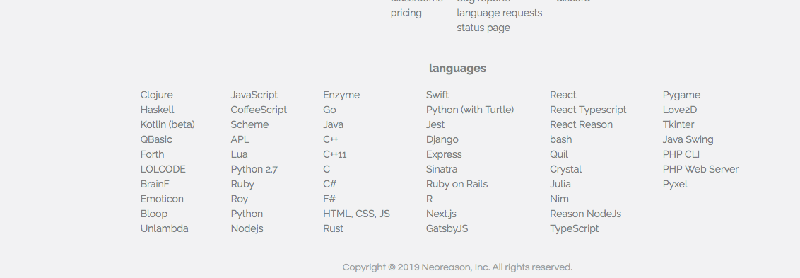

# Build Your Own Website from Scratch Workshop

This workshop contains the following activities:
* Interact with HTML, CSS and JavaScript code as the foundation of website code
* Setup a Wordpress instance on Heroku with a free account
* Create and deploy your new Wordpress website on Heroku

## Setup
* Create a free account on `https://repl.it`
* Create a free account on Heroku at `https://signup.heroku.com/login`

## HTML, CSS and JS (JavaScript)
We are going to interact with the various key code components of websites using `repl.it`. 

> At the bottom of `https://repl.it` after you've setup your account, select the language `HTML, CSS, JS`:

