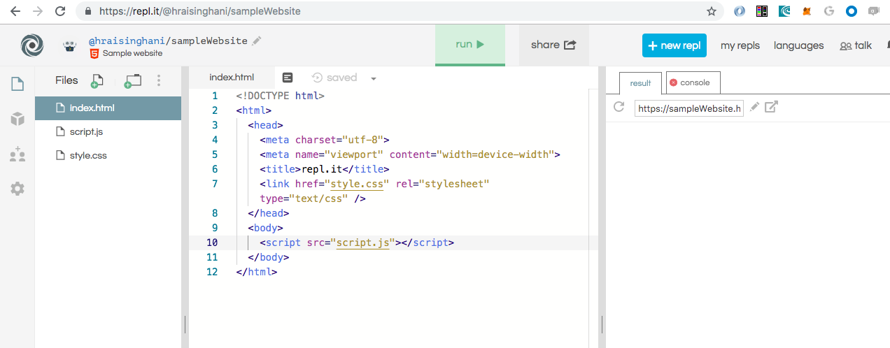
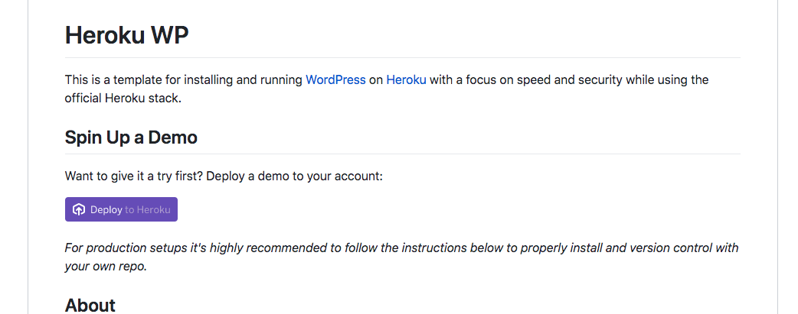

# Build Your Own Website from Scratch Workshop

This workshop contains the following activities:
* Interact with HTML, CSS and JavaScript code as the foundation of website code
* Setup a Wordpress instance on Heroku with a free account
* Create and deploy your new Wordpress website on Heroku

## Setup
* Create a free account on `https://repl.it`
* Create a free account on Heroku at `https://signup.heroku.com/login`

## HTML, CSS and JS (JavaScript)
We are going to interact with the various key code components of websites using `repl.it`. HTML (structure) + CSS (style) + JS (interaction)  = webpage

We are going to create a travel blog website from scratch!

> At the bottom of `https://repl.it` after you've setup your account, select the language `HTML, CSS, JS`:


> Update the name of your page and give it a description (e.g. `sampleWebsite` as in the following screenshot):



When you run the boilerplate website code, your website is running on a custom domain - `https://sampleWebsite.hraisinghani.repl.co` in the above case. Our website is live in real-time on the internet!

### HTML
To cover:
* `html`, `head`, `body`, `script`s
* `h1`, `h2`, `h3`, `<p>`, ``, `<hr>`, `<br>`
* Adding style:
  * inline
  * `<style></style>` in the HTML `head`
* Concept of `div`s
* Elements and Classes

#### Boilerplate code
```
<!DOCTYPE html>
<html>
  <head>
    <meta charset="utf-8">
    <meta name="viewport" content="width=device-width">
    <title>Sample Website</title>
    <link href="style.css" rel="stylesheet" type="text/css" />
  </head>
  <body>
    <script src="script.js"></script>
  </body>
</html>
```
* Elements are types of HTML items that can be used in an HTML file, such as headings (`h1`), paragraphs (`p`). For a full list of elements, see https://developer.mozilla.org/en-US/docs/Web/HTML/Element.

* Element references inside of `<>` are called **tags**. For example, `<p>`, `<h1>`, `<head>`, `<body>`.

Some key components in our template code:
* `<!DOCTYPE html>` - tells browsers which version of HTML is used
  
* `<html></html>` - HTMl root element contains one `<head>` and one `<body>` element.
  
* `<head></head>` - a container element that can contain a number of sub-elements which are either metadata or pull in external resources like CSS stylesheets. Sub-element tags we will use are `<title></title>` (which is always required), `<style></style>` for adding some custom styling and `<link></link>` for our pulling in our CSS (which is the way you should pull in custom styling)
  
* `<body></body>` -  the container which holds all the content of the document. Also contains sub-elements like `<script></script>` to pull in external resources.

> Modify the `<title></title>` element of your website

> Add in the following into the `<body></body>` element:
* A heading level 1: `<h1> Your Header </h1>`

* Two paragraphs: `<p> Your paragraph text </p>`

* An image from the web: `

* A web link to another site: `<a href="https://example.com"> Text for your Link </a>`

The `<div></div>` tags represent a container unit which help divide the HTML document and group together elements into sections. 

> Add `<div></div>` tags around each of your paragraphs

#### Styling


### CSS

* Using `style.css` to get the same styling

### JS
* Be able to access document elements and update them


## Setup Wordpress on Heroku

`https://github.com/xyu/heroku-wp`

> Click on `Deploy to Heroku` to run setup a demo instance



