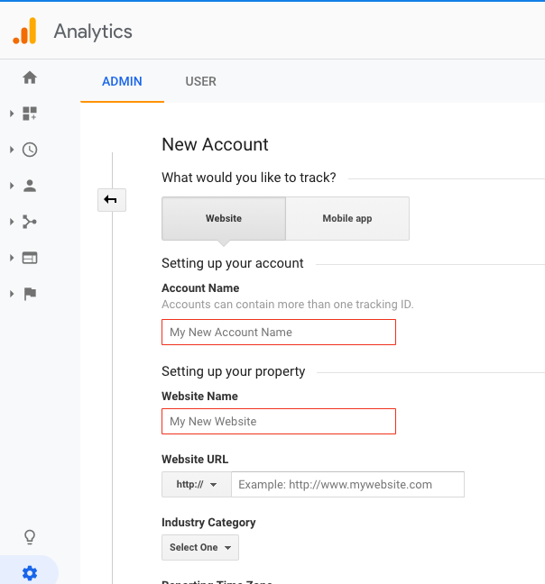
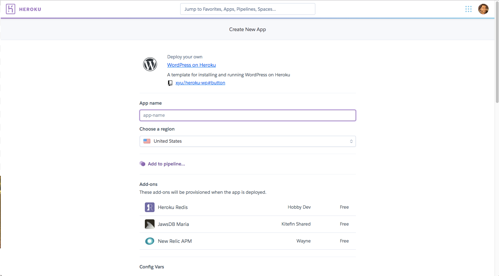
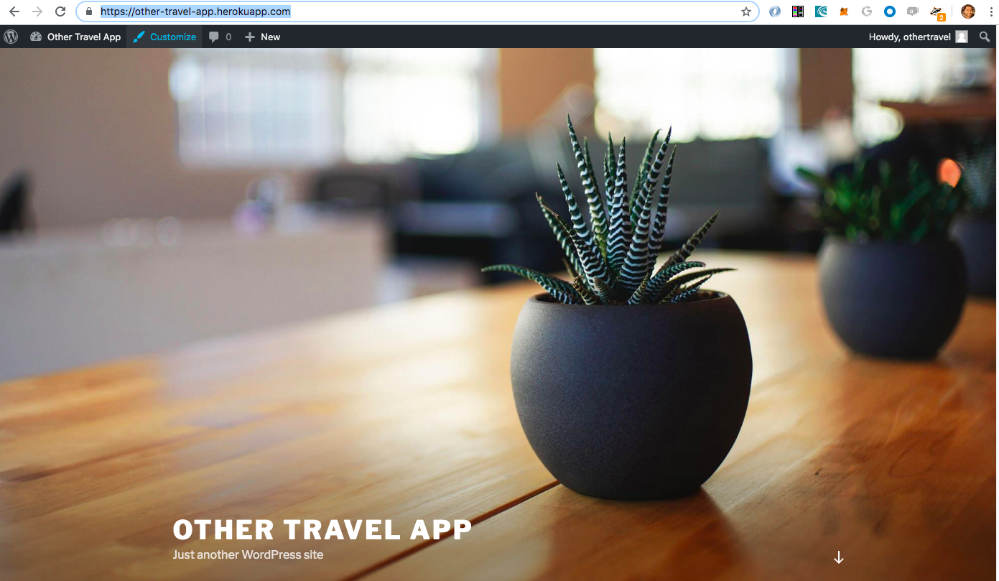

# Build Your Own Website from Scratch Workshop

This workshop contains the following activities:
* Interact with HTML, CSS and JavaScript code as the foundation of website code
* Setup a Wordpress instance on Heroku with a free account
* Create and deploy your new Wordpress website on Heroku

## Setup
* Create a free account on `https://repl.it`

* Create a 'free account' on Heroku at `https://signup.heroku.com/`. Note - in order to use the Wordpress add-on, you will need to verify your Heroku account using a credit card. You will get 1000 free hours of use per month. See https://devcenter.heroku.com/articles/account-verification

* Create a free Google account, which will be used for Google Analytics

## HTML, CSS and JS (JavaScript)
We are going to interact with the various key code components of websites using `repl.it`. HTML (structure) + CSS (style) + JS (interaction)  = webpage

We are going to create a travel blog website from scratch!

> At the bottom of `https://repl.it` after you've setup your account, select the language `HTML, CSS, JS`:


> Update the name of your page and give it a description (e.g. `sampleWebsite` as in the following screenshot):


When you run the boilerplate website code, your website is running on a custom domain - `https://sampleWebsite.hraisinghani.repl.co` in the above case. Our website is live in real-time on the internet!

### HTML
To cover:
* `html`, `head`, `body`, `script`s
* `h1`, `h2`, `h3`, `<p>`, ``, `<hr>`, `<br>`
* Adding style:
  * inline
  * `<style></style>` in the HTML `head`
* Concept of `div`s
* Elements and Classes

#### Boilerplate code
```
<!DOCTYPE html>
<html>
  <head>
    <meta charset="utf-8">
    <meta name="viewport" content="width=device-width">
    <title>Sample Website</title>
    <link href="style.css" rel="stylesheet" type="text/css" />
  </head>
  <body>
    <script src="script.js"></script>
  </body>
</html>
```
* Elements are types of HTML items that can be used in an HTML file, such as headings (`h1`), paragraphs (`p`). For a full list of elements, see https://developer.mozilla.org/en-US/docs/Web/HTML/Element.

* Element references inside of `<>` are called **tags**. For example, `<p>`, `<h1>`, `<head>`, `<body>`.

Some key components in our template code:
* `<!DOCTYPE html>` - tells browsers which version of HTML is used
  
* `<html></html>` - HTMl root element contains one `<head>` and one `<body>` element.
  
* `<head></head>` - a container element that can contain a number of sub-elements which are either metadata or pull in external resources like CSS stylesheets. Sub-element tags we will use are `<title></title>` (which is always required), `<style></style>` for adding some custom styling and `<link></link>` for our pulling in our CSS (which is the way you should pull in custom styling)
  
* `<body></body>` -  the container which holds all the content of the document. Also contains sub-elements like `<script></script>` to pull in external resources.

> Modify the `<title></title>` element of your website

> Add in the following into the `<body></body>` element:
* A heading level 1: `<h1> Your Header </h1>`

* Two paragraphs: `<p> Your paragraph text </p>`

* An image from the web: `

* A web link to another site: `<a href="https://example.com"> Text for your Link </a>`

The `<div></div>` tags represent a container unit which help divide the HTML document and group together elements into sections. 

> Add `<div></div>` tags around each of your paragraphs

### CSS (for Styling)
There is an ocean of knowledge on the subject of CSS and best practices. For an intro tutorial, see: https://www.w3schools.com/css/css_intro.asp 

We'll only touch upon the basics here.

#### Inline Styling
An inline CSS is used to apply a unique style to a single HTML element:

`<h1 style="color:blue;">This is a Blue Heading</h1>`

> Apply inline CSS to your paragraph element

#### Internal CSS
An internal CSS is defined in the `<head>` section of an HTML page within a `<style>` element:
```
<head>
    <style>
        body {background-color: powderblue;}
        h1   {color: blue;}
        p    {color: red;}
    </style>
</head>
```
> Apply internal CSS to your h1 element.

#### External CSS file
An external style sheet is used to define the style for many HTML pages.

With an external style sheet, you can change the look of an entire web site, by changing one file!

To use an external style sheet, add a `<link>` element to it in the `<head>` section of the HTML page:

```
<head>

    <link href="style.css" rel="stylesheet" type="text/css" />
</head>
```

#### Classes vs. IDs
* Classes - used to denote multiple elements that will receive the same sytling. In the HTML code, classess are denoted using the element keyword `class` in an HTML element:

```
<div class="introduction-section">
```

* IDs - are unique and can apply to only one element on the page:
```
<div class="introduction-section">
    <p id="flight-details"> .... </p>
</div>
```

In your external CSS file (i.e. `style.css`), class names are referenced with a `.` and id names with a `#`:
```
.introduction-section {
    color: red;
}

#flight-details {
    color: blue;
}
```

> Replace any inline and internal CSS styling with external CSS defined in `style.css`.

### JS
* Used to add behaviour to your webpage
* For example, be able to access document elements and update them
* Internal JavaScript is added using the `<script></script>` element tags in either the `<head>` or `<body>`
* 

Example (from w3schools.com):
```
<!DOCTYPE html>
<html>
<head>
    <script>
    function myFunction() {
        document.getElementById("demo").innerHTML = "Paragraph changed.";
    }
    </script>
</head>
<body>
    <h2>JavaScript in Head</h2>

    <p id="demo">A Paragraph.</p>

    <button type="button" onclick="myFunction()">Try it</button>
</body>
</html>
```

### Add Website tracking (e.g. Google Analytics)
Tracking websites provides useful insights into what pages your users are viewing, for how long, from where, etc.. Here, we'll add a simple Google Analytics code snippet to track our demo Repl.it website.

> Use your Google Account to sign into Google Analytics at https://analytics.google.com/web/

> Under the `Admin` panel, create a `New Account` to track a website. Enter in an Account Name, your Website Name and use the URL of our demo Repl.it website (e.g. https://samplewebsite.hraisinghani.repl.co/).  



> Uncheck all the Data Sharing Settings and click on `Get Tracking ID`. You'll get a code snipped containing your Google Analytics tracking ID. Simply copy and paste this piece of code into your `<head>` element:

```
<head>
    <!-- Global site tag (gtag.js) - Google Analytics -->
    <script async src="https://www.googletagmanager.com/gtag/js?id=UA-141780281-1"></script>

    <script>
      window.dataLayer = window.dataLayer || [];
      function gtag(){dataLayer.push(arguments);}
      gtag('js', new Date());

      gtag('config', 'UA-141780281-1');
    </script>
    ...
</head>
```
> Now open up a few incognito tabs and go to your website. Observe what happens on your Google Analytics Home dashboard!

There is a **ton** of information in Google Analytics so have fun exploring all the interesting data available!

## Setup Wordpress on Heroku
Now we will create our website using Wordpress, a tool for creating websites supporting different types of web contents (i.e. blogs, mailing lists, forums, online stores, etc...). 

Other website hosted solutions (usually for a monthly subscription fee) include:
* Squarespace.com
* WIX.com

You can download and host Wordpress for free locally (https://wordpress.org) or used their hosted solution for a fee (https://wordpress.com). We are going to use Heroku for our Wordpress hosting solution, which offers a free basic hosting service. 

> Go to `https://github.com/xyu/heroku-wp`

> Click on `Deploy to Heroku` to run setup a demo instance


> You will be directed to Heroku and asked to enter in your App name (all lowercase, words separated by hyphens). **This will makeup your website URL**. Scroll to the very bottom and select `Deploy app`. 



> Now go to `https://<your-app-name>.heorkuapp.com` to setup your Wordpress instance with a username/password and voila - your custom hosted website is ready!

> Select `Customize` and start editing your website!



**Note:** Because this is hosted Wordpress instance on Heroku is using a free/basic server, there might be functionality that is restricted (e.g. number of available plugins). Paying for a higher tier of service will unlock additional functionality.
